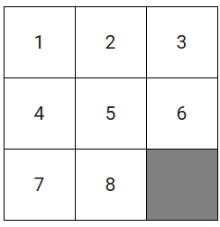

# 8-Puzzle Simulation

A classic tile-based puzzle simulation where the goal is to arrange a 3x3 grid of numbered tiles into the correct order using the A* search algorithm. The simulation visualizes each move from a shuffled, solvable initial state to the goal configuration.

## Demo Video

  
*Click the image to download the full demo video.*

## Features

- **Randomized, Solvable Initial State**  
  Starts with a shuffled puzzle that is guaranteed to be solvable, with user control over the empty tile's starting position.

- **A* Search Algorithm**  
  Solves the puzzle using A* search with Manhattan distance as the heuristic.

- **Step-by-Step Grid Visualization**  
  Each move is visualized in a clean HTML grid with clear transitions and tile movement.

- **Real-Time Commentary**  
  Displays contextual commentary for each move (e.g., moved blank tile up, down, left, right).

- **Interactive and Traceable Simulation**  
  Provides a complete trace of the solution path, from initial to goal state, including move descriptions.

## How it Works

The simulation starts by asking the user to enter the starting position of the empty tile (1–9). A random but solvable configuration is then generated. The A* algorithm searches for the optimal path to the goal state. At each step, the current state of the grid is rendered visually and paired with commentary that explains the move made.
