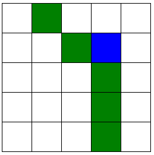

# Autonomous Vacuum Cleaner Simulation

An AI-driven vacuum cleaner that navigates a grid, cleans dirt patches, and returns to a target location using heuristic-based pathfinding.

## Demo Video

  
*Click the image to view the full demo video.*

## Features

- **Configurable Grid Environment**  
  Allows users to input grid size, number of dirt patches, and select custom start and end positions.

- **Randomized Dirt Placement**  
  Dirt patches are placed randomly across the grid for each simulation.

- **Heuristic-based Pathfinding**  
  Uses Manhattan distance to select the closest dirt patch or move toward the end location.

- **Stateful Movement Logic**  
  Tracks visited positions and resets when needed to ensure full coverage.

- **Step-by-Step Visualization**  
  Real-time visual updates in an HTML table using IPython display tools.

- **Commentary Logging**  
  Displays ongoing commentary to explain the vacuum's actions at each step.

- **Return-to-Base Behavior**  
  Once all dirt is cleaned, the vacuum automatically navigates to the end position.

## How it Works

The simulation starts with user-defined grid size and dirt count. Dirt is placed randomly, and the vacuum begins at a specified location. It moves toward the nearest dirt using Manhattan distance, cleaning as it goes. After cleaning all dirt patches, it travels to the specified end position. The simulation displays a real-time HTML grid and logs each action with commentary.