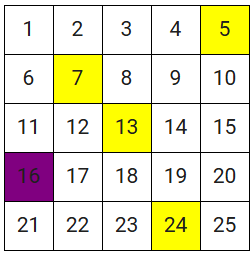

# Monkey and Banana Simulation

A grid-based simulation where a monkey must first acquire a table before collecting and eating randomly placed bananas using heuristic pathfinding.

## Demo Video

  
*Click the image to download the full demo video.*

## Features

- **Configurable Grid Environment**  
  Users can define grid size, number of bananas, and specify the starting positions of the monkey and the table.

- **Randomized Banana Placement**  
  Bananas are placed randomly across the grid, excluding the table's location.

- **Two-Phase Navigation Strategy**  
  The monkey first moves to the table, then begins collecting bananas one by one.

- **Heuristic-based Pathfinding**  
  Uses Manhattan distance to determine the shortest path toward the target (table or banana).

- **Expanded Movement Set**  
  Supports both orthogonal and diagonal moves, allowing more natural navigation.

- **Real-Time Grid Visualization**  
  Displays a dynamic grid using HTML via IPython, highlighting monkey movement, banana locations, and the table.

- **Step-by-Step Commentary**  
  Action logs are displayed alongside the grid to explain what the monkey is doing at each step.

## How it Works

The user sets up the simulation by providing a grid size, number of bananas, and positions for the monkey and the table. The simulation initializes a grid with bananas randomly placed (excluding the table position). The monkey moves step-by-step toward the table, claims it, then navigates to the nearest banana and eats it. This continues until all bananas are eaten. Throughout the process, the simulation updates the grid visually and prints commentary explaining the monkey’s actions.
