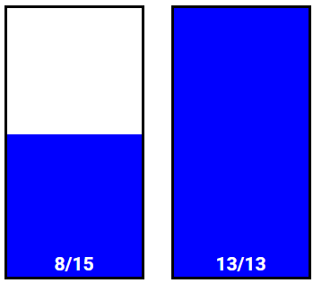

# Water Jug Simulation

A step-by-step simulation of the classic water jug problem, where the goal is to measure an exact amount of water using two jugs of different capacities. The simulation uses breadth-first search and displays each action visually.

## Demo Video

  
*Click the image to view the full demo video.*

## Features

- **User-Defined Jug Capacities**  
  Allows users to input custom capacities for two jugs and a target volume.

- **Automatic Solution via BFS**  
  Uses breadth-first search to find the shortest sequence of operations to reach the target amount.

- **Step-by-Step Visualization**  
  Each state is visualized in real time using vertical water level indicators with labeled capacities.

- **Action Commentary**  
  Describes each action taken at every step—filling, emptying, or pouring water between jugs.

- **Terminal and HTML Display Integration**  
  Works seamlessly in notebook environments using `IPython.display` to render HTML representations of the jug states.

## How it Works

The simulation starts with both jugs empty. It systematically explores all possible operations (fill, empty, pour) using breadth-first search. Once a solution is found, it reconstructs the path from start to goal and visualizes each step. Commentary is displayed alongside the jug states to explain the reasoning behind each action.